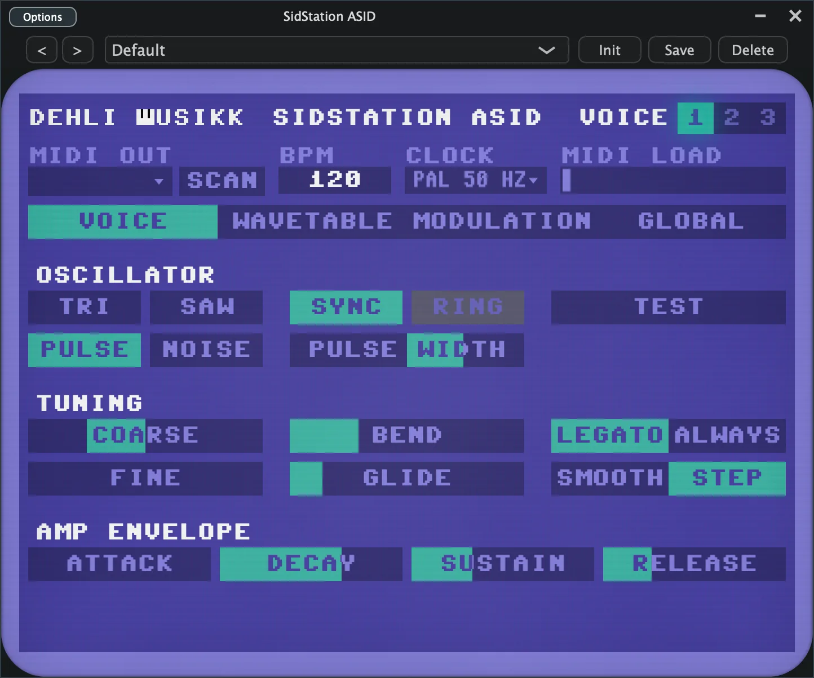
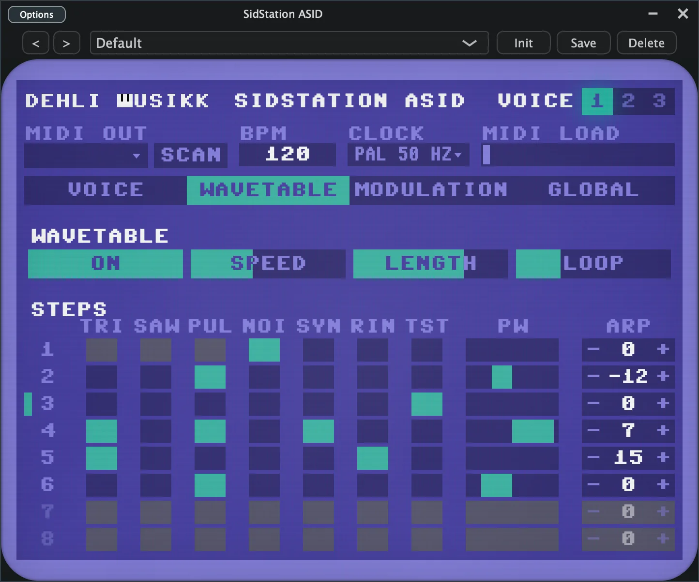
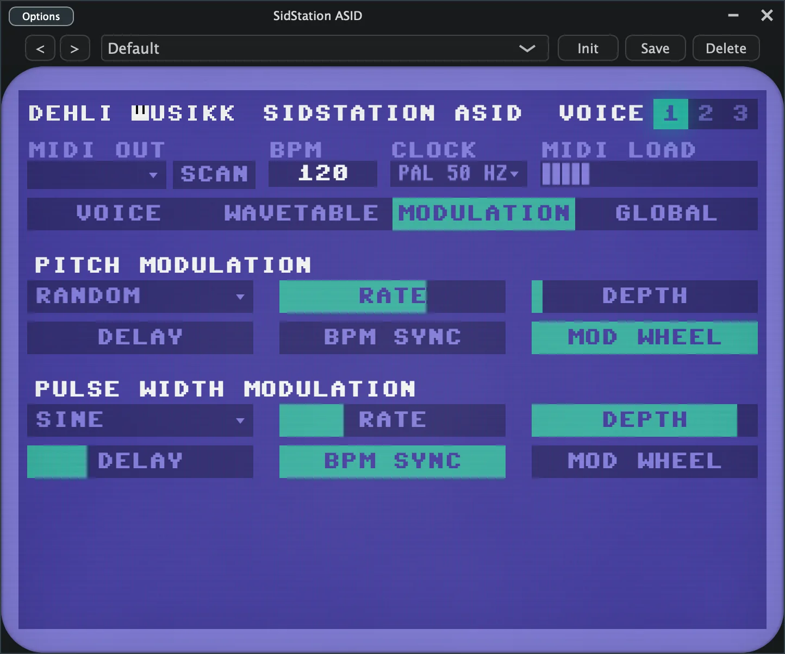
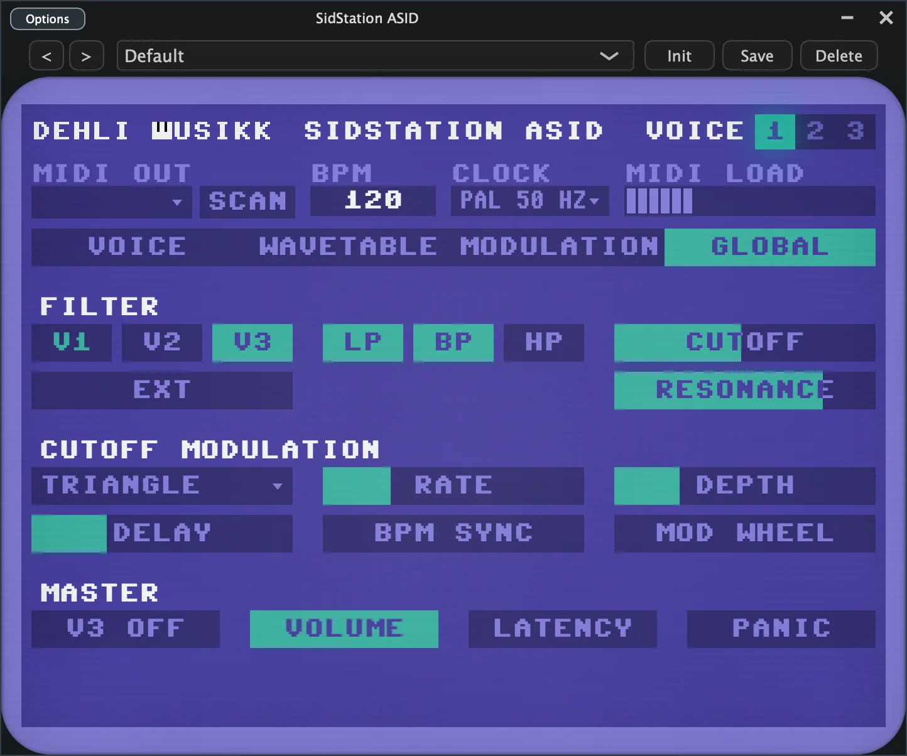

# SidStation ASID

A cross platform plugin (VST3, AU, Standalone) for the Elektron SidStation, the MOS6581 SID desktop synth.

macOS first.

## What it is

SidStation ASID streams raw SID registers over the ASID protocol instead of sending MIDI CC, so every register is reachable and each voice gets its own pitch and gate. One instance drives one voice. Put an instance on each of three DAW tracks, pick a voice per track, and the three voices become three monosynths you can sequence apart. Getting that out of the SidStation on its own is awkward.

Put the unit in ASID mode from the front panel before playing.

## What it does

Per voice:

- The four SID waveforms, combinable, with noise exclusive as on the real chip.
- ADSR envelope, pulse width, coarse and fine tuning, and pitch bend with an adjustable range.
- Hard sync, ring modulation, and the raw TEST bit.
- Portamento, with a legato or always trigger and a smooth or stepped glide.
- An eight step wavetable, each step with its own waveform, sync, ring, test, pulse width and arpeggio offset, plus speed, length and a loop point.
- Three LFOs (pitch, pulse width, cutoff) with several shapes, a free Hz or host tempo synced rate, depth, mod wheel scaling, and a fade in delay.

Shared across the three voices, since the chip has one of each:

- The filter: cutoff, resonance, per voice routing, external input, and combinable low, band and high pass modes.
- Master volume, and a switch to silence voice 3 so it can serve as a pure modulation source for ring and sync.

Around the sound:

- A Commodore 64 styled pixel interface, colour coded per voice.
- Voice presets saved to disk, so a sound outlives the DAW project it was made in. Init puts a voice back to its default sound.
- A tempo readout (the host tempo in a DAW, or set by hand in Standalone), and a Panic that releases every voice.
- A MIDI load meter, since the SidStation shares one slow MIDI port across all three voices.

## The four tabs

The dark strip along the top is the same on every tab. It holds the MIDI output picker with a Scan button, the tempo and the clock rate, a MIDI load meter, the voice selector, and the preset bar (browse with the arrows or the menu, then Init, Save and Delete).

### Voice



Everything that shapes a single voice. Oscillator has the four combinable waveforms with Sync, Ring, Test and Pulse Width. Tuning has coarse and fine pitch, the bend range, the glide time, and the glide trigger (Legato or Always) and type (Smooth or Step) switches. Amp Envelope is the ADSR.

### Wavetable



An eight step table that drives the waveform and more, one step per tick. The top row sets whether it runs, plus speed, length and the loop point. Each step row carries its waveform (Tri, Saw, Pulse, Noise), Sync, Ring and Test, a pulse width fader, and an arpeggio offset. The loop point and the playing step are marked on the left.

### Modulation



Two LFOs for this voice, one on pitch and one on pulse width. Each has a shape, a rate that is free in Hz or locked to the host tempo as a note division, a depth, a Mod Wheel switch so the wheel scales the depth, and a fade in Delay. Set the shape to Off and the LFO stops.

### Global



The settings the SID shares across all three voices. Filter has per voice routing (V1, V2, V3), the external input, the combinable LP, BP and HP modes, and Cutoff and Resonance. Cutoff Modulation is a third LFO on the filter cutoff. Master has the Voice 3 Off switch, Volume, Latency and Panic.

## Status

- Usable for playing the three voices.
- Voice presets (save, browse, delete) are in. Factory presets are not yet.
- Developed and tested against OS 1.11 R34 hardware on macOS. Windows and Linux are untested.

## Layout

| Directory | What it is                                                                                                 |
| --------- | ---------------------------------------------------------------------------------------------------------- |
| `core/`   | Framework agnostic C++17 library for the SidStation MIDI, SysEx and ASID protocols, with no dependencies and its own tests. |
| `asid/`   | The plugin itself, including its JUCE UI and MIDI device layer.                                             |
| `probe/`  | Command line tool for checking the protocol against real hardware.                                          |

## Build

Via CMake and JUCE:

```sh
cmake -B build -DCMAKE_BUILD_TYPE=Release
cmake --build build
```

JUCE is fetched automatically by the root CMakeLists. With copy after build on, the AU and VST3 land in your user plugin folders, and the Standalone app is the quickest way to test.

To run the core library tests without JUCE:

```sh
cd core && make test
```

## Hardware notes

`core/README.md` records what came out of testing against a real unit. The one that shaped the whole plugin: on OS 1.11 R34 firmware the SysEx Direct Program path is dead, so streaming raw SID registers over ASID is the only way in.
